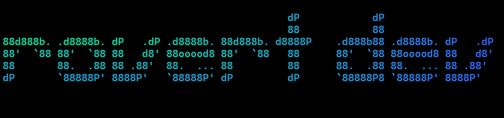

# ASCII Art Generator with Gradient Colors

This Python script generates ASCII art with gradient colors. It allows you to create visually stunning text banners
using a variety of fonts and color gradients.

## Features

- Generate ASCII art with gradient colors.
- Choose from a wide range of fonts.
- Customize the gradient direction (vertical, horizontal, or both).
- Save the output to a file.

## Requirements

- [Python](https://www.python.org/downloads/) 3.6 or higher
- [Git](https://git-scm.com/) (optional for cloning the repository)
- Terminal that supports ANSI escape codes - e.g. [Windows Terminal](https://github.com/microsoft/terminal)

## Installation

1. Clone this repository to your local machine:

    ```bash
    git clone https://github.com/R-udren/ascii-art-generator.git
    ```

2. Navigate to the project directory:

    ```bash
    cd ascii-art-generator
    ```

3. Install the required Python packages:

    ```bash
    pip install -r requirements.txt
    ```

## Usage

Run the script with the following command:

```bash
python ascii_art_generator.py [options]
```

### Options

- `text`: Text for the banner.
- `--show-fonts`: Show available fonts.
- `--font`: Font for the banner (default: slant).
- `-f`, `--from-color`: Starting color in RGB format (default: 255 0 0).
- `-t`, `--to-color`: Ending color in RGB format (default: 0 0 255).
- `-d`, `--direction`: Gradient direction (choices: vertical, horizontal, both; default: both).
- `-o`, `--output-file`: File to save the output ASCII art.

### Example

Generate an ASCII art banner with the text "Hello World":

```bash
python ascii_art_generator.py "Hello World"
```

[](images/hello_world.png)

One more example:

```bash
python ascii_art_generator.py "rovert dev" --font nancyj-fancy -f 0 255 125 -t 50 100 255
```

[](images/dev.png)

Generate an ASCII art banner with the text "rovert", gradient and save it to a file:

```bash
python ascii_art_generator.py "rovert" --font bloody --from-color 255 0 125 --to-color 125 0 255 -d both -o banner.txt
```

[](images/rovert.png)

## Acknowledgements

- [pyfiglet](https://github.com/pwaller/pyfiglet) - ASCII art fonts library.

## Author

- [rovert](https://github.com/R-udren)
